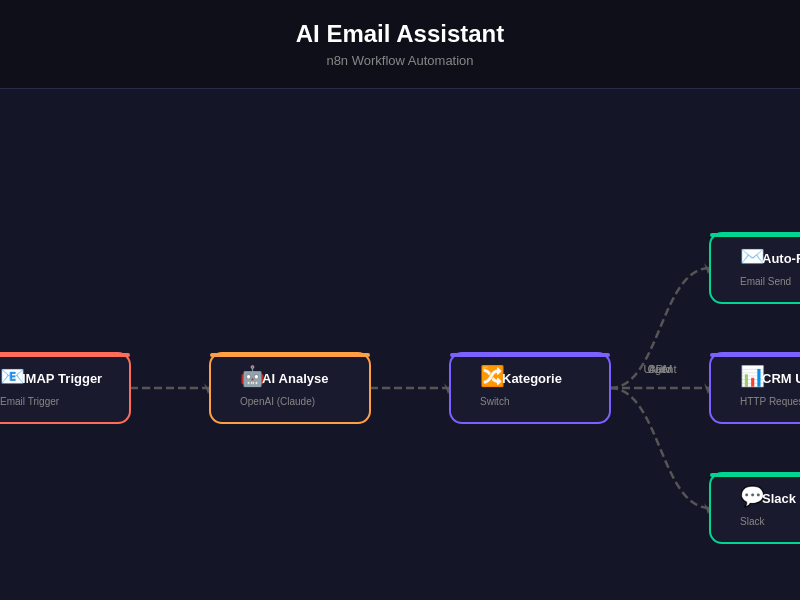
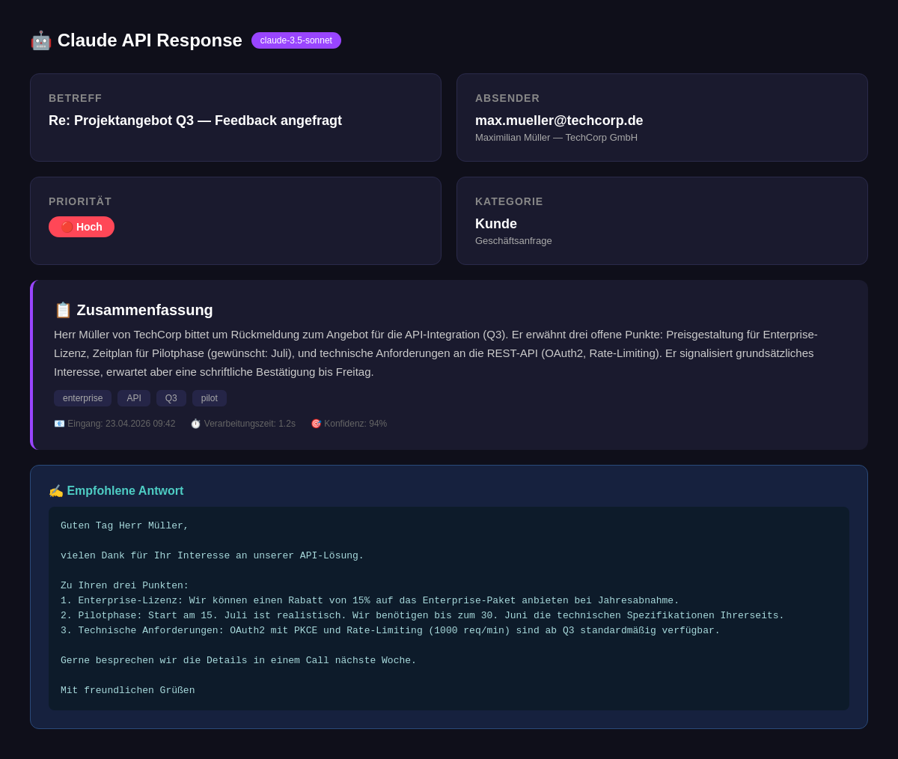
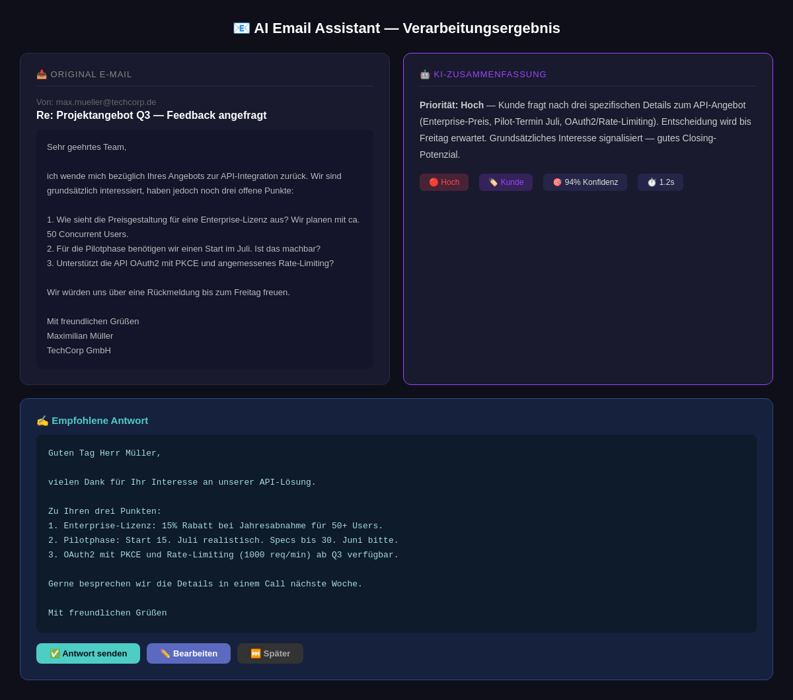
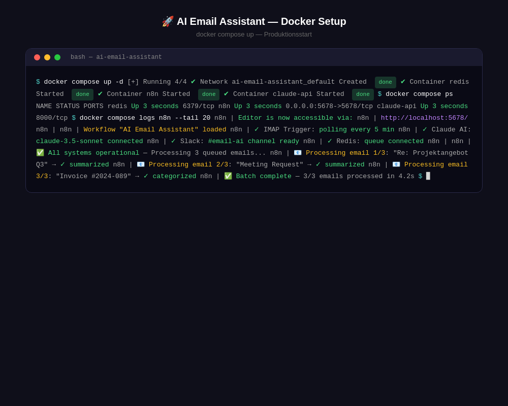

# AI Email Assistant

[](https://n8n.io)
[](https://anthropic.com)
[](LICENSE)
[]()

> KI-gestützter E-Mail-Assistent: Zusammenfassen, Antworten, Kategorisieren — DSGVO-konform & selbstgehostet.

AI-powered email assistant: summarize, draft responses, categorize — GDPR-compliant & self-hosted.

---

## Screenshots

### n8n Workflow


*Kompletter E-Mail-Verarbeitungs-Workflow in n8n — IMAP → Claude AI → Slack. 7 Nodes, darunter zwei Claude AI Nodes für Zusammenfassung und Antwort-Generierung.*

### Claude API Response


*Beispielhafte Claude API Antwort: E-Mail wird analysiert, zusammengefasst, priorisiert und eine professionelle Antwort wird vorgeschlagen — alles in unter 2 Sekunden.*

### E-Mail Zusammenfassung — Strukturierte Ausgabe


*Side-by-Side Ansicht: Original E-Mail (links) und KI-Zusammenfassung (rechts) mit Priorität, Kategorie und empfohlener Antwort.*

### Setup & Running


*Docker Compose Start: Alle Services (n8n, Redis, Claude API) starten in Sekunden. Batch-Verarbeitung von 3 E-Mails in 4.2s.*

---

## Features

| Feature | Beschreibung |
|---------|-------------|
| E-Mail-Zusammenfassung | Eingehende E-Mails automatisch zusammengefasst |
| Antwort-Generierung | Professionelle Antwortentwürfe auf Deutsch |
| Prioritäts-Klassifizierung | Hoch / Mittel / Niedrig |
| Typ-Kategorisierung | Kunde / Lieferant / Intern / Spam |
| Slack-Benachrichtigung | Wichtige E-Mails direkt an Slack |
| Template-Builder | Anpassbare Antwort-Templates |
| DSGVO-konform | Selbstgehostet, keine Datenweitergabe |

---

## 🚀 Schnellstart

### Voraussetzungen

| Komponente | Version | Zweck |
|---|---|---|
| Docker & Docker Compose | 20.10+ / 2.0+ | Container-Deployment |
| Claude API Key | aktuell | KI-E-Mail-Analyse |
| IMAP-Zugang | — | E-Mail-Postfach |
| n8n | neueste | Workflow-Engine |
| Slack (optional) | — | Benachrichtigungen |

### Installation

```bash
git clone https://github.com/ceeceeceecee/ai-email-assistant.git
cd ai-email-assistant

# Konfiguration kopieren und anpassen
cp config/settings.example.json config/settings.json
# API-Keys & IMAP-Zugang eintragen

# Services starten
docker compose up -d
```

### Erste Schritte

1. **n8n öffnen** (Standard: `http://localhost:5678`) und Workflows importieren
2. **E-Mail-Verbindung** in n8n konfigurieren (IMAP-Zugangsdaten)
3. **Test-E-Mail** senden und KI-Zusammenfassung prüfen
4. **Slack-Integration** (optional) für Benachrichtigungen einrichten

Siehe [docs/setup-guide.md](docs/setup-guide.md) für die vollständige Anleitung.

---

## Use Cases

| Szenario | Nutzen |
|----------|--------|
| Kundenanfragen | Sofortiger Überblick über Anliegen |
| Terminanfragen | Automatische Entwürfe für Bestätigungen |
| Beschwerden | Vorgeschlagene deeskalierende Antworten |
| Angebote | Strukturierte Zusammenfassung für Vertrieb |

---

## Tech Stack

- **n8n** — Workflow-Orchestrierung
- **Claude (Anthropic)** — KI-Textverarbeitung
- **Redis** — Job-Queue & Caching
- **Docker Compose** — Deployment

---

## Roadmap

- [ ] Auto-Reply mit Genehmigungs-Workflow
- [ ] Outlook / Exchange IMAP Support
- [ ] Mehrsprachige Antwort-Generierung
- [ ] Analytics Dashboard

---

## Contributing

1. Fork → Feature-Branch → Commit → Push → Pull Request

---

## Lizenz

[MIT](LICENSE) — frei nutzbar.

## Author

[ceeceeceecee](https://github.com/ceeceeceecee)

## Weitere Projekte

- [n8n Business Automation](https://github.com/ceeceeceecee/n8n-business-automation) — Workflow-Templates für KMU
- [Self-Hosted AI Chatbot](https://github.com/ceeceeceecee/self-hosted-ai-chatbot) — DSGVO-konformer Chatbot
